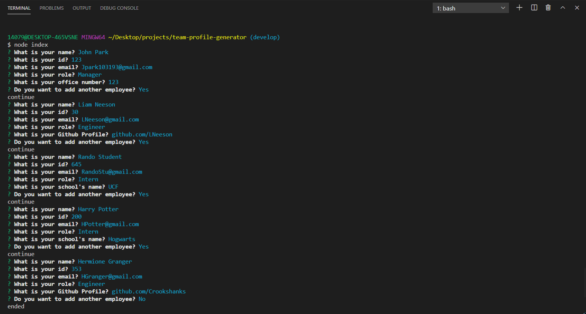
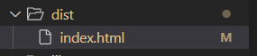

# README Generator

## Table of Contents

* [Description](#Description)
* [Installation](#Installation)
* [Usage](#Usage)
* [License](#License)
* [Contributing](#Contributing)
* [Test](#Test)

## Description
This application is a command line application which will generate profile cards for individuals in a software engineering team. The application will line a series of questions about the employee and add additional information based on their roles. The user can add any number of individuals into the profile generator and once they have concluded how many members they wish to add the application will create an index.html with numerous profile cards with each employees information.

## Installation
Prior to starting this application you must initiate to make a local package.json file.

    npm init

Then you must install the inquirer and jest module and its JSON files

    npm install inquirer 
    npm install jest

Once this is finished check your package.json file and update the scripts for test to "jest" to allow for testing the code

## Usage
The application will first begin with a series of questions as shown below

Once the application has concluded a new directory called "dist" will be made with an "index.html" file which will hold all of our profile cards

## License
MIT  

## Badges

## Contributing
For anyone who wishes to contribute you can contact me with the information below

## Test
Each of the classes and constructor functions were tested using the "Jest" module using the command

    npm test 

Would you like to reach us?
 
Contact Me:

Github: https://github.com/aznjp

Email: Jpark103193@gmail.com
